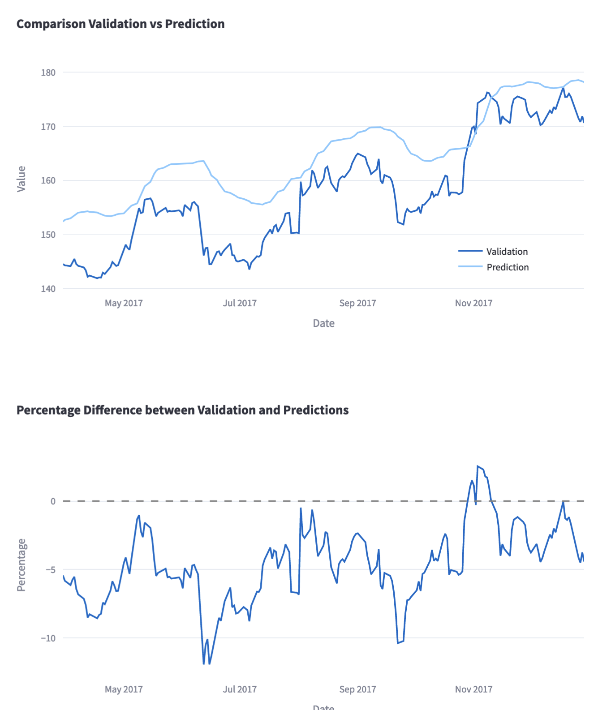

# StockMarket LSTM Model
A user-friendly application leveraging LSTM neural networks in Python with Keras, Firebase and Streamlit for predicting stock market trends.

<!-- > Live demo [_here_](https://www.example.com). If you have the project hosted somewhere, include the link here. -->

## Table of Contents
* [General Info](#general-information)
* [Technologies Used](#technologies-used)
* [Features](#features)
* [Screenshots](#screenshots)
* [Setup](#setup)
* [Usage](#usage)
* [Project Status](#project-status)
* [Room for Improvement](#room-for-improvement)
* [Acknowledgements](#acknowledgements)
* [Contact](#contact)
<!-- * [License](#license) -->


## General Information

The application serves as an interactive platform for experimenting with LSTM neural networks by allowing users to modify training hyperparameters. With each experiment, the app provides performance metrics and visualizations of the network's predictions. Furthermore, all data is stored in a cloud-hosted NoSQL database, facilitating subsequent analysis to determine optimal hyperparameters for neural network performance.

## General Information

### Description
The application serves as an interactive platform for experimenting with LSTM neural networks by allowing users to modify training hyperparameters. With each experiment, the app provides performance metrics and visualizations of the network's predictions. Furthermore, all data is stored in a cloud-hosted NoSQL database, facilitating subsequent analysis to determine optimal hyperparameters for neural network performance.


- LSTM: Long Short Term Memory networks are a type of recurrent neural network (RNN) that can learn long sequences of inputs.

### Purpose
The primary objective of this project is to showcase my skills as a data scientist, demonstrating proficiency in handling end-to-end tasks on a real-world project. The project follows a structured seven-phase approach:

1. **Data Collection:** Utilizing a CSV file from a relevant article on LSTM Models.
2. **Data Exploration:** Thorough exploration of the dataset for a better understanding in the context of the model to be constructed.
3. **Building Data Pipeline (Data Cleaning/Data Wrangling):** Ensuring the absence of erroneous or missing values. The dataset is split into training-validation sets. Given the sequential importance, data scaling is performed instead of normalization.
4. **Data Visualization:** Focused on a single data series, providing a temporal visualization of the training-validation split.
5. **Model Building:** Pre-processing to correct data dimensions followed by the construction and training of a 'Sequential' model for 'many-to-one' prediction.
6. **Model Prediction:** Reverse normalization of predictions and subsequent performance analysis.
7. **Model in Production:** Creation of a web app based on the constructed model, enabling hyperparameter modification and experiment reproduction for training optimization.

## Technologies Used
- **Python 3.10:** Core programming language.
- **Keras 2.13:** High-level neural networks API, providing a convenient interface for building and training neural networks.
- **Firebase:** Cloud-hosted NoSQL database for efficient data storage and retrieval.
- **Streamlit 1.26:** Open-source Python library for creating web applications with minimal effort.
- **Pandas 2.1 and NumPy 1.24:** Data manipulation and numerical operations in Python.
- **Plotly 5.17:** Interactive data visualization library for creating insightful plots.
- **Scikit-learn 1.16:** Simple and efficient tools for data mining and data analysis.

## Features
1. **Customizable Model Training:**
   - Allow users to customize hyperparameters and observe real-time model performance.

2. **Interactive Visualization:**
   - Implement Plotly for interactive visualizations.
   - Dynamic time range selection for visualizations.

3. **Metric Tracking:**
   - Track and display metrics (MSE, MAE, R^2) for each model run.

4. **Database Integration:**
   - Highlight Google Cloud Firestore integration.
   - Add a mechanism to download records.

5. **Feature Selection:**
   - Allow users to choose input features for prediction.

6. **Data Exploration:**
   - Include additional visualizations for dataset exploration.

7. **Percentage Difference Analysis:**
   - Enhance Percentage Difference chart with more insights.

8. **Responsive UI:**
   - Ensure responsiveness for different devices.

9. **Documentation Links:**
   - Add links to Colab notebooks, GitHub repositories, etc.

10. **Record Details:**
    - Include training duration, convergence graphs, or anomalies in each record.

## Screenshots
The home screen of the mobile app has five main sections:

1. A section introducing the app and the dataset with a visualization. This section provides a brief overview of the app and the dataset it uses. It also includes a visualization of the dataset, which can help users understand the data they are working with.


2. A section for model customization. This section allows users to customize the model they are using. They can change the model's hyperparameters, such as the number of layers or the learning rate. They can also select different features to train the model on.

3. A section to showcase performance metrics. This section displays the performance metrics of the model. These metrics can help users evaluate the performance of the model and make adjustments as needed.


4. A section for visualization of model performance. This section provides visualizations of the model's performance. These visualizations can help users understand how the model is performing and identify any areas that need improvement.



5. A section to showcase the dataset resulting from the app experimentation. This section displays the dataset that was created as a result of the app's experimentation. This dataset can be used to train other models or to perform further analysis.


## Setup
What are the project requirements/dependencies? Where are they listed? A requirements.txt or a Pipfile.lock file perhaps? Where is it located?

Proceed to describe how to install / setup one's local environment / get started with the project.

## Setup
1. **Requirements:**
   - The list of required packages is specified in the [requirements.txt](./requirements.txt) file.

2. **Local Development Environment:**
   - Create a virtual environment in the project directory:
     ```bash
     python -m venv venv
     ```
   - Activate the virtual environment:
     - On Windows: `venv\Scripts\activate`
     - On macOS/Linux: `source venv/bin/activate`

3. **Fork and Clone the Repository:**
   - Fork the repository using the "Fork" button at the top right of this page.
   - Clone the repository to your local machine:
     ```bash
     git clone https://github.com/YOUR_USERNAME/StockMarket-LSTM-Model.git
     ```

4. **Install Dependencies:**
   - Navigate to the project directory:
     ```bash
     cd StockMarket-LSTM-Model
     ```
   - Install the required dependencies using:
     ```bash
     pip install -r requirements.txt
     ```

5. **Run the Application Locally:**
   - Start the Streamlit application:
     ```bash
     streamlit run streamlit_app.py
     ```

   The application should open in your default web browser.

**Note:** Ensure that you have [Python](https://www.python.org/downloads/) and [Git](https://git-scm.com/downloads) installed on your machine before proceeding.

Feel free to experiment with the application and customize it according to your needs!


## Usage
Follow these steps to use the Stock Market LSTM Model for stock price prediction:

1. **Run the Application:**
   - Ensure that you have set up the local development environment as explained in the [Setup](#setup) section.
   - Start the Streamlit application by running the following command in the terminal:
     ```bash
     streamlit run streamlit_app.py
     ```
   - The application will open in your default web browser.

2. **Explore the Dataset:**
   - Navigate to the "Dataset" section in the application.
   - View the Apple stock market dataset and its visualization.

3. **Understand the Features:**
   - Visit the "Features" section to understand the features available for testing the model.

4. **Build and Train the Model:**
   - Go to the "Model Training" section.
   - Choose the input feature, number of neurons, epochs, and batch size for the LSTM model.
   - Click on the "Build the model!" button to train the model.

5. **Evaluate Model Performance:**
   - Check the "Metrics of the Model" section to see the performance metrics of the trained model.

6. **Visualize Results:**
   - Explore the "Visualization of Results" section to compare the validation data with the model's predictions.

7. **Record Training Experiments:**
   - The "Training Record" section displays a record of each training experiment, providing insights into the effectiveness of different configurations.

8. **Experiment and Optimize:**
   - Experiment with different hyperparameters and features to optimize the performance of the LSTM model.

9. **Contribute:**
   - If you discover improvements or have ideas, consider contributing by creating a pull request or opening an issue.

Enjoy using the Stock Market LSTM Model for interactive and customizable stock price prediction!

## Project Status
The Stock Market LSTM Model project is currently **in progress**. The core functionalities, such as data visualization, model training, and result analysis, are implemented and functional. However, there is ongoing work to enhance and optimize the user interface, add more features, and improve the overall user experience.

### Completed Features
- Dataset exploration and visualization.
- LSTM model training with customizable hyperparameters.
- Evaluation metrics display for model performance analysis.
- Visualization of model predictions compared to actual data.
- Record keeping of training experiments.

## Room for Improvement
### In Progress
- Refining user interface design and interaction.
- Adding more options for feature selection and model customization.
- Exploring and integrating additional datasets for broader testing.

### Future Plans
- Incorporating real-time data updates.
- Implementing advanced model architectures for comparison.
- Enhancing the application's responsiveness for a smoother user experience.

The project is open to contributions, and feedback is highly appreciated. Feel free to check the [Issues](https://github.com/rodrigo-dls/StockMarket-LSTM-Model/issues) for upcoming features or report any bugs or suggestions.

## Acknowledgements
This project wouldn't have been possible without the support and contributions of various individuals and resources. I would like to express my gratitude to:

- **[Name]**: Brief description or reason for acknowledgment.
- **[Tutorial/Resource]**: A special thanks to [this tutorial/resource](https://www.example.com) for providing valuable insights and guidance.

I also extend my appreciation to the open-source community and developers whose work has been foundational to this project. Their dedication has been instrumental in shaping and improving this application.

Feel free to check out their work and show your support:

- [Link to GitHub profile or relevant page]

If I missed anyone, please accept my apologies, and your contribution is genuinely appreciated.

## Contact

Feel free to reach out if you have any questions, suggestions, or just want to connect! You can contact me via:
- LinkedIn: [Rodrigo de los Santos](https://www.linkedin.com/in/rodrigo-de-los-santos/)
- Email: [rodri.m.dls@gmail.com](mailto:rodri.m.dls@gmail.com)


<!-- Optional -->
<!-- ## License -->
<!-- This project is open source and available under the [... License](). -->
